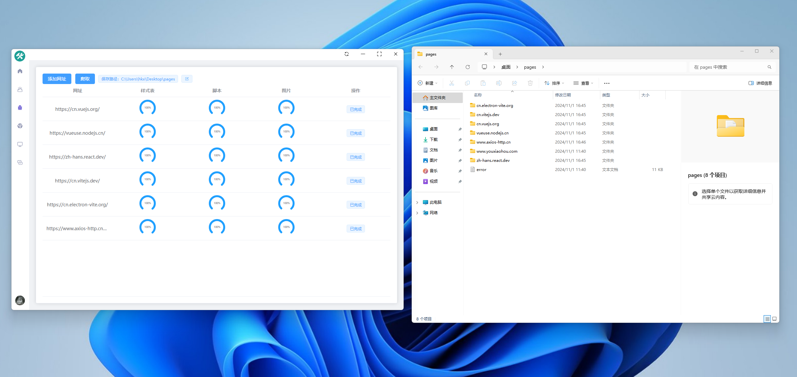
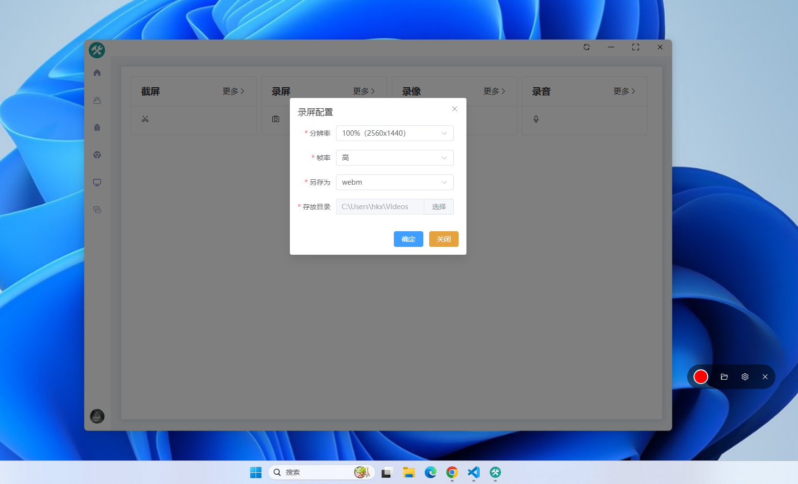
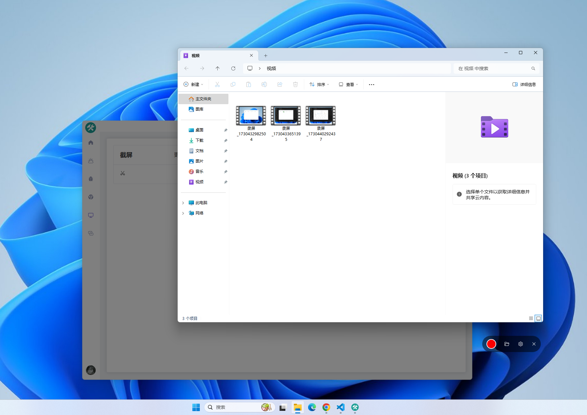
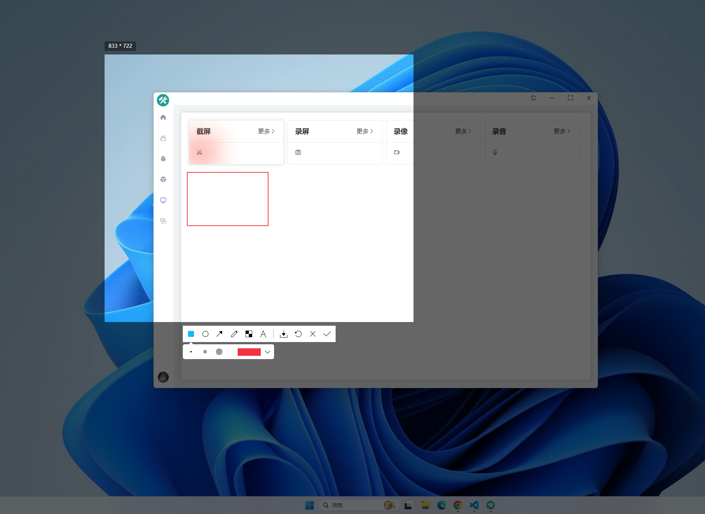
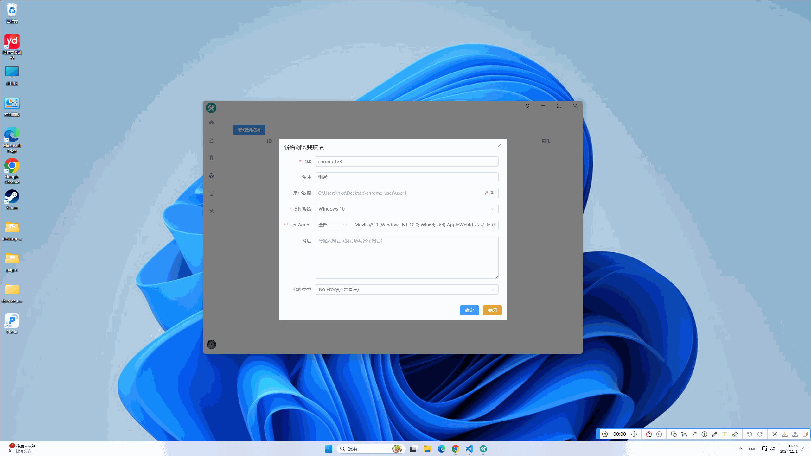
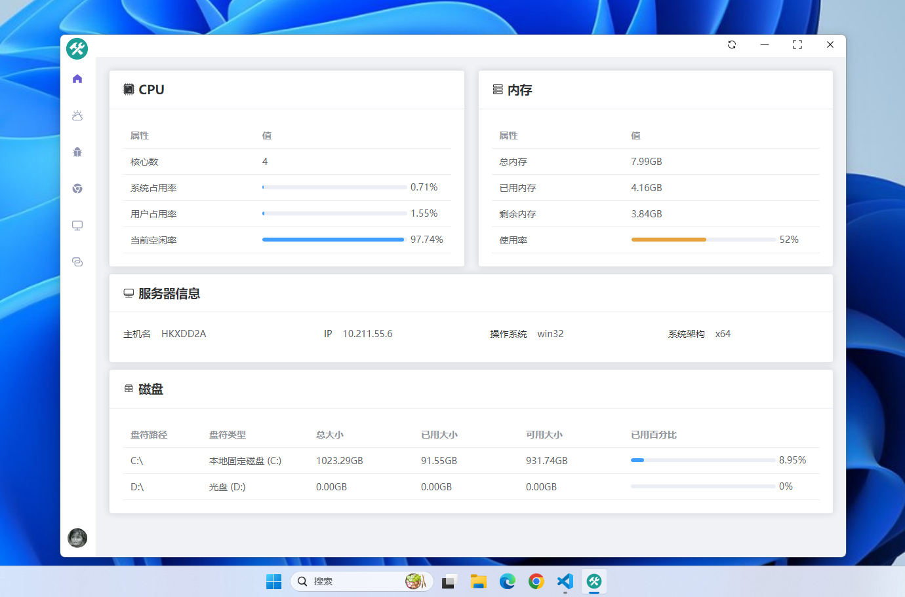
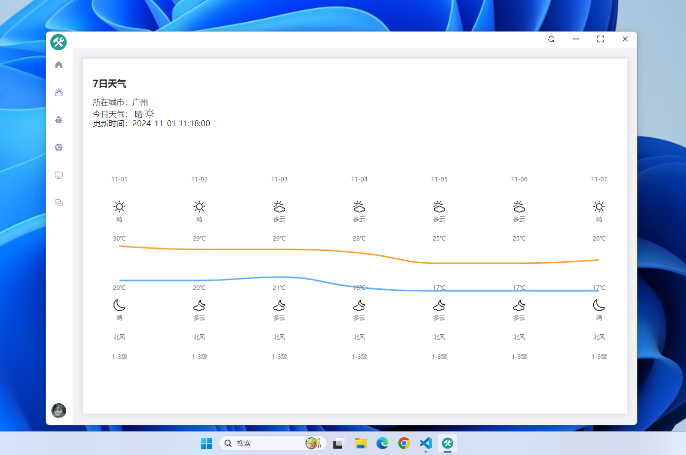

<div align="center">
    
    <h1>Desktop toolkit</h1>
    <p>🐹基于 Electron 和 Vue 的桌面工具箱</p>
    <a href="https://www.electronjs.org" style="text-decoration:none;margin:0.5em">Electron✅</a>
    <a href="https://cn.vuejs.org" style="text-decoration:none;margin:0.5em">Vue✅</a>
    <a href="https://developer.mozilla.org/en-US/docs/Web/API/WebRTC_API" style="text-decoration:none;margin:0.5em">WebRTC✅</a>
    <a href="https://github.com/nut-tree/nut.js" style="text-decoration:none;margin:0.5em">Nut.js✅</a>
    <a href="https://github.com/puppeteer/puppeteer" style="text-decoration:none;margin:0.5em">Puppeteer✅</a>
</div>
<hr>
<br>

## 🍍Introduction
- 一个支持远程控制、网页爬取、截屏、录屏、指纹浏览器、服务监控，天气信息等功能的桌面工具箱
- 信令服务：[toolkit-server](https://gitee.com/hkx75749899/toolkit-server)

## 🍓Software Interface
<div align="center">
    <h4>1.远程控制</h4>
    
    </video>
    <h4>2.网页爬取</h4>
    
    <h4>3.录屏</h4>
    <div style="display:flex;">
      
      
    </div>
    <div style="display:flex;">
      <div>
        <h4>4.截屏</h4>
        
      </div>
      <div>
        <h4>5.指纹浏览器</h4>
        
      </div>
    </div>
    <div style="display:flex;">
      <div>
        <h4>6.服务监控</h4>
        
      </div>
      <div>
        <h4>7.天气</h4>
        
      </div>
    </div>
</div>

## 🍉Installation

1. 下载源代码：
```bash
git clone https://github.com/sunnypg/desktop-toolkit.git
```
2. 安装依赖：
```bash
cd desktop-toolkit
npm install
```
3. 启动：
```bash
npm run dev
```
更多设置请查阅：[electron-vite](https://cn.electron-vite.org/)

## 🍞License
[MIT License](./LICENSE)
